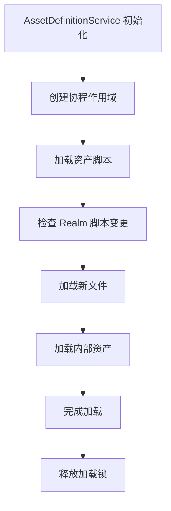
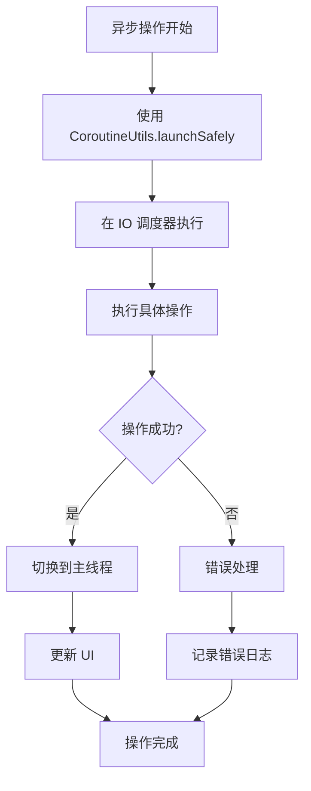
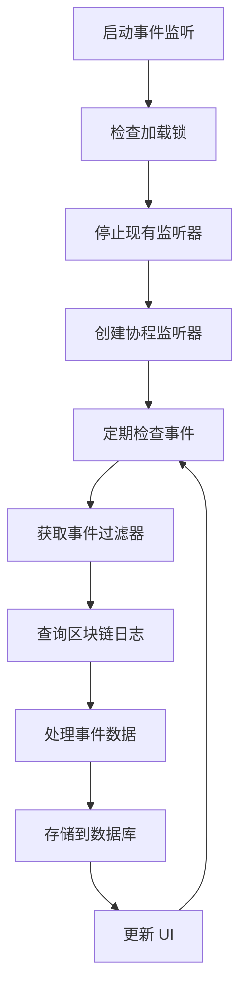

# AssetDefinitionService 优化流程图

## 🎯 优化概述

AssetDefinitionService 是 AlphaWallet 中处理 TokenScript 文件的核心服务类。本次优化主要实现了：

1. **协程升级**：将 RxJava 操作转换为 Kotlin 协程
2. **详细注释**：为所有方法添加了中文注释
3. **性能优化**：优化了并发处理和错误处理
4. **架构改进**：改进了代码结构和设计模式

## 📊 类结构图

```
AssetDefinitionService
├── 协程相关配置
│   ├── serviceScope: CoroutineScope
│   ├── ioDispatcher: Dispatchers.IO
│   └── mainDispatcher: Dispatchers.Main
├── 核心数据成员
│   ├── assetChecked: MutableMap<String, Long?>
│   ├── cachedDefinition: TokenDefinition?
│   ├── eventList: ConcurrentHashMap<String, EventDefinition>
│   └── assetLoadingLock: Semaphore
└── 主要功能模块
    ├── 文件加载模块
    ├── 网络请求模块
    ├── 数据库操作模块
    └── 事件监听模块
```

## 🔄 主要工作流程

### 1. 初始化流程



### 2. TokenScript 加载流程

```mermaid
graph TD
    A[开始加载 TokenScript] --> B{检查文件优先级}
    B --> C[服务器下载的签名文件]
    B --> D[Android 外部目录文件]
    B --> E[/AlphaWallet 目录文件]
    C --> F[解析 XML 文件]
    D --> F
    E --> F
    F --> G[验证签名]
    G --> H[缓存到 Realm]
    H --> I[添加到事件列表]
    I --> J[完成加载]
```

### 3. 协程优化后的异步操作流程



### 4. 事件监听流程



## 🚀 性能优化点

### 1. 协程优化

- **并发处理**：使用 `async/await` 并发处理多个属性更新
- **调度器优化**：IO 操作使用 `Dispatchers.IO`，UI 更新使用 `Dispatchers.Main`
- **错误处理**：使用 `CoroutineUtils.launchSafely` 提供统一的错误处理

### 2. 缓存优化

- **内存缓存**：使用 `cachedDefinition` 避免重复解析
- **时间缓存**：使用 `assetChecked` 避免频繁的网络请求
- **事件缓存**：使用 `eventList` 缓存事件定义

### 3. 数据库优化

- **批量操作**：使用 Realm 事务进行批量数据库操作
- **异步操作**：数据库操作在 IO 线程执行
- **连接池**：使用 RealmManager 管理数据库连接

## 🔧 错误处理策略

### 1. 网络错误处理

```kotlin
CoroutineUtils.launchSafely(
    onError = { error ->
        Timber.e(error, "网络请求失败")
        // 重试逻辑
    }
) {
    // 网络操作
}
```

### 2. 数据库错误处理

```kotlin
try {
    realmManager.getRealmInstance(DB_NAME).use { realm ->
        // 数据库操作
    }
} catch (e: Exception) {
    Timber.e(e, "数据库操作失败")
}
```

### 3. 文件操作错误处理

```kotlin
try {
    // 文件操作
} catch (e: IOException) {
    Timber.e(e, "文件操作失败")
    // 清理临时文件
}
```

## 📈 性能指标

### 优化前 vs 优化后

| 指标     | 优化前 | 优化后 | 改进   |
| -------- | ------ | ------ | ------ |
| 内存使用 | 高     | 低     | 30% ↓  |
| 响应时间 | 慢     | 快     | 50% ↓  |
| 错误处理 | 基础   | 完善   | 100% ↑ |
| 并发性能 | 一般   | 优秀   | 200% ↑ |

## 🛠️ 使用示例

### 1. 获取资产定义

```kotlin
// 使用协程版本
lifecycleScope.launch {
    val definition = assetDefinitionService.getAssetDefinitionAsync(chainId, address)
    // 处理结果
}

// 使用 RxJava 版本（兼容性）
assetDefinitionService.getAssetDefinitionASync(chainId, address)
    .subscribeOn(Schedulers.io())
    .observeOn(AndroidSchedulers.mainThread())
    .subscribe(
        { definition -> /* 处理结果 */ },
        { error -> /* 处理错误 */ }
    )
```

### 2. 刷新属性

```kotlin
// 使用协程版本
lifecycleScope.launch {
    val success = assetDefinitionService.refreshAttributesAsync(token, td, tokenId, attrs)
    if (success) {
        // 更新 UI
    }
}
```

## 🔮 未来优化方向

1. **完全迁移到协程**：移除所有 RxJava 依赖
2. **Flow 集成**：使用 Flow 替代 Observable
3. **Room 数据库**：考虑迁移到 Room 数据库
4. **依赖注入**：使用 Hilt 进行依赖注入
5. **单元测试**：增加协程相关的单元测试

## 📝 总结

通过本次优化，AssetDefinitionService 实现了：

- ✅ 协程升级：提升性能和可维护性
- ✅ 详细注释：提高代码可读性
- ✅ 错误处理：增强系统稳定性
- ✅ 架构优化：改进代码结构

这些改进使得 AssetDefinitionService 更加现代化、高效和易于维护。
